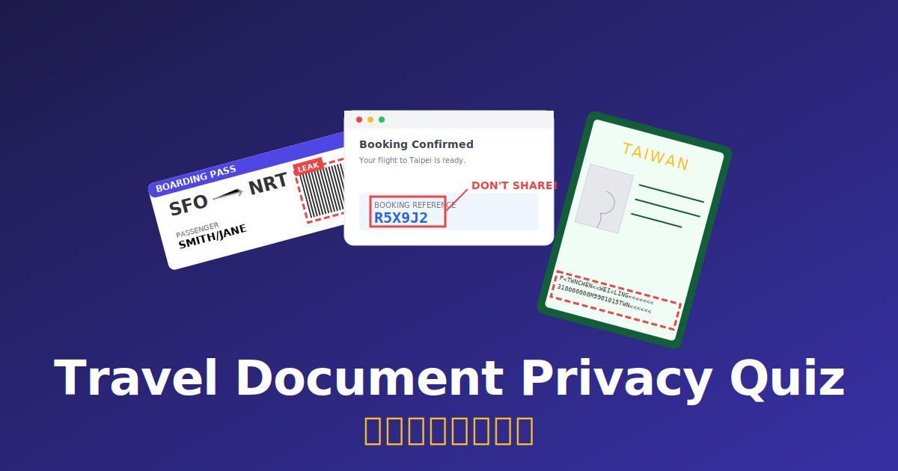

# Travel Document Privacy Quiz | 旅行文件隱私測驗

> I am tired of seeing people sharing their personal information on social networks. Let's raise awareness of travel document privacy!  
> 我受夠了看到大家在社群網路上隨意分享個人資料。讓我們一起提升旅遊文件隱私意識！



## 🎮 About The Project
This is an interactive educational game designed to teach travelers about the hidden privacy risks in their travel documents. Through a series of realistic scenarios, players learn to identify sensitive information on **Boarding Passes**, **Passports**, **Luggage Tags**, and **Confirmation Emails** that should never be shared publicly.

> [!NOTE]
> The quiz is a purely **vibe coding** product built with **Google Gemini**.


## 🚀 Getting Started

### Prerequisites

- Node.js (v18 or higher recommended)
- npm

### Installation

1. Clone the repository:
   ```bash
   git clone https://github.com/LouieLu/travel-document-privacy-game.git
   cd travel-document-privacy-game
   ```

2. Install dependencies:
   ```bash
   npm install
   ```

### Running Locally

Start the development server:
```bash
npm run dev
```
Open `http://localhost:5173` in your browser.

### Building for Production

Build the project for deployment:
```bash
npm run build
```
The output will be in the `dist/` folder.

## 🌍 Deployment

This project is configured for easy deployment to **GitHub Pages**.

1. Ensure your `vite.config.js` has the correct `base` path (currently set to relative `./`).
2. Run the deployment script:
   ```bash
   npm run deploy
   ```
   This will build the project and push the `dist` folder to the `gh-pages` branch.

## 📄 License

This project is licensed under the **Clear BSD License**. See the full text in [LICENSE](LICENSE).
